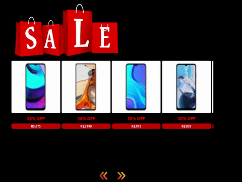

#  Projeto Carrossel  de produtos   🛍️ 🎁

## :memo: Descrição

Projeto Carrosel de produtos em promoção utilizando React.

## :books: Funcionalidades
* <b>Funcionalidade </b>:  Utilizando API do Mercado livre (https://api.mercadolibre.com/sites/MLB/search?q=cel),  aplicação contém um slideshow que faz um giro nos conteúdos de produtos que estão em promoção.

## :wrench: Tecnologias utilizadas
* JavaScript;
* React;
* HTML;
* CSS;

## :soon: Implementação futura
* tornar a aplicação responsiva
* incluir os links dos produtos
